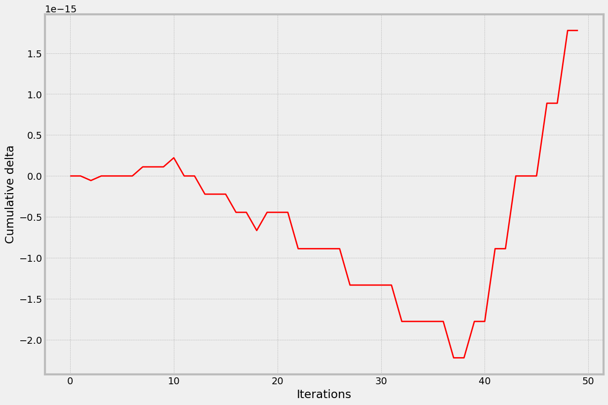
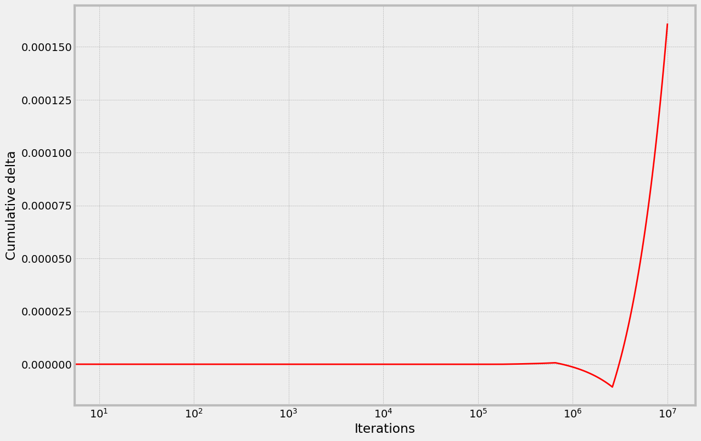
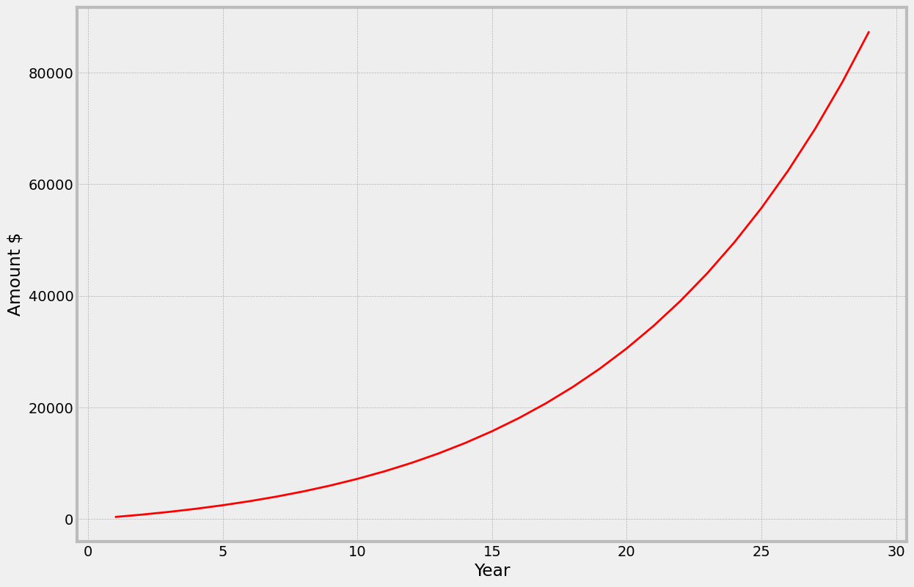

# 💰 The High Cost of Floating-Point Errors: Why You Shouldn't Pay Double

## 🎯 Introduction: It's All About the Money

As enterprise software engineers, we work on large, complicated systems. This requires broad knowledge in diverse areas and deep expertise in others: programming languages, databases, systems design, and more. This knowledge helps us solve real business problems, generate revenue, or even save lives in health-related software; that's what we are paid for. But... we are human. We make mistakes. Even when requirements are clear, the architecture is well-designed, and all tickets are closed, bugs can still appear. They might be simple, like an incorrect sort order in an SQL query result. However, some can be critical, like the infamous [Ariane flight V88](https://en.wikipedia.org/wiki/Ariane_flight_V88) failure, which cost US$370 million due to a floating-point conversion error. Engineers assumed a physical value wouldn't exceed the limits of a 16-bit integer (an optimization choice), but reality proved otherwise. Hopefully, the engineers involved recovered from the incident. My position is that responsibility for such bugs doesn't lie solely with developers but also involves QA engineers who approve functionality, code reviewers who assess quality, and potentially external factors.

This article focuses on a specific class of bugs similar to the Ariane 5 incident – those arising not from flawed system design, incorrect business logic, or obvious errors like typos, but from the subtle and often misunderstood nature of floating-point numbers.

Part of my experience as a software engineer involves financial services, where precision is paramount. Money is a sensitive topic. You wouldn't be happy to see your bank account balance decrease inexplicably, and a tax inspector will have questions if even a single penny is unaccounted for in a report.

Mistakes with floating-point numbers happen repeatedly. Nearly every project I've worked on has had incidents related to them. A recent occurrence after a hotfix deployment inspired me to consolidate my thoughts on this topic.

Let's dive in.

## ⚡ Too Long; Didn't Read (TL;DR)

Use specialized libraries or types designed for handling monetary values, high-precision calculations, and rounding accurately. Here are examples for Java and Go:

**Java**

Use `java.math.BigDecimal`.
[Link: java.math.BigDecimal](https://docs.oracle.com/javase/8/docs/api/java/math/BigDecimal.html)

```Java
package org.grevtsev.backend.core;

import java.math.BigDecimal;
import java.math.RoundingMode; // Example: Needed for specific rounding
import java.util.concurrent.atomic.AtomicReference;

public class Account {
    // Use BigDecimal for monetary values
    private final AtomicReference<BigDecimal> balance;
    private static final int SCALE = 2; // Define precision (e.g., 2 decimal places for USD)
    private static final RoundingMode ROUNDING_MODE = RoundingMode.HALF_UP; // Define rounding strategy

    public Account() {
        // Initialize balance to zero with the defined scale
        this.balance = new AtomicReference<>(BigDecimal.ZERO.setScale(SCALE, ROUNDING_MODE));
    }

    public void add(BigDecimal amount) {
        // Always validate input
        if (amount == null || amount.compareTo(BigDecimal.ZERO) <= 0) {
            throw new IllegalArgumentException("Amount must be positive.");
        }
        // Ensure amount has the correct scale and rounding
        BigDecimal scaledAmount = amount.setScale(SCALE, ROUNDING_MODE);
        BigDecimal currentVal;
        BigDecimal newVal;
        do {
            currentVal = balance.get();
            newVal = currentVal.add(scaledAmount);
        } while (!balance.compareAndSet(currentVal, newVal));
    }

    public void withdraw(BigDecimal amount) {
        if (amount == null || amount.compareTo(BigDecimal.ZERO) <= 0) {
            throw new IllegalArgumentException("Amount must be positive.");
        }
        BigDecimal scaledAmount = amount.setScale(SCALE, ROUNDING_MODE);
        BigDecimal currentVal;
        BigDecimal newVal;
        do {
            currentVal = balance.get();
            if (currentVal.compareTo(scaledAmount) < 0) {
                throw new IllegalArgumentException("Insufficient balance on account.");
            }
            newVal = currentVal.subtract(scaledAmount);
            // Ensure the result maintains the scale
            newVal = newVal.setScale(SCALE, ROUNDING_MODE);
        } while (!balance.compareAndSet(currentVal, newVal));
    }

    public BigDecimal getBalance() {
        return balance.get();
    }
}
```

**Golang**

Use a dedicated decimal library like `github.com/shopspring/decimal`.
[Link: github.com/shopspring/decimal](https://pkg.go.dev/github.com/shopspring/decimal)

```Go
package main

import (
	"errors"
	"sync/atomic"

	"github.com/shopspring/decimal"
)

var (
    errInvalidAmount       = errors.New("amount must be positive")
    errInsufficientBalance = errors.New("insufficient balance on account")
)

// Account manages a balance using decimal types for precision.
type Account struct {
    balance atomic.Value
}

// NewAccount creates a new account with an initial balance.
func NewAccount(initialBalance decimal.Decimal) *Account {
	acc := &Account{}
	// Ensure initial balance is stored correctly.
	// Use non-panic operations in production if initialBalance could be invalid.
	acc.balance.Store(initialBalance)
	return acc
}

// Add increases the account balance by the given amount.
func (acc *Account) Add(amount decimal.Decimal) error {
    if amount.IsNegative() || amount.IsZero() {
        return errInvalidAmount
    }

	for {
		oldVal := acc.balance.Load().(decimal.Decimal)
		newVal := oldVal.Add(amount)
		if acc.balance.CompareAndSwap(oldVal, newVal) {
			return nil
		}
		// If CAS failed, loop again with the updated oldVal
	}
}

// Withdraw decreases the account balance by the given amount.
func (acc *Account) Withdraw(amount decimal.Decimal) error {
    if amount.IsNegative() || amount.IsZero() {
        return errInvalidAmount
    }

	for {
		oldVal := acc.balance.Load().(decimal.Decimal)
		// Check for sufficient funds before calculating the new balance
		if oldVal.LessThan(amount) {
			return errInsufficientBalance
		}
		newVal := oldVal.Sub(amount)
		if acc.balance.CompareAndSwap(oldVal, newVal) {
			return nil
		}
		// If CAS failed, loop again with the updated oldVal
	}
}

func (acc *Account) GetBalance() decimal.Decimal {
    return acc.balance.Load().(decimal.Decimal)
}
```

For other languages, the principle remains the same: find a suitable library or built-in type for arbitrary-precision decimal arithmetic and use it consistently for financial calculations.

## 🔍 How BigDecimal and Decimal Work

Both `BigDecimal` (Java) and `decimal` (Go) provide precise decimal arithmetic by avoiding binary floating-point representation. Here's how they work:

### 🏗️ Internal Representation
- **BigDecimal**: Stores numbers as an unscaled integer and scale (e.g., `123.45` as `12345` with scale `2`)
- **Decimal**: Uses integer value and exponent (e.g., `123.45` as `12345 * 10^-2`)

### 🌟 Key Features
1. **Precise Arithmetic**
   - No binary floating-point rounding errors
   - Exact decimal representation
   - Controlled rounding behavior

2. **Immutability**
   - Operations return new instances
   - Thread-safe by design
   - No side effects

3. **Performance Trade-off**
   - Slower than native floating-point types
   - More memory usage
   - Suitable for financial calculations

### 📋 Usage Guidelines
- Use for monetary values
- Specify precision and rounding rules
- Avoid mixing with native floating-point types
- Handle division with explicit rounding

## ⚠️ What Goes Wrong with Native Floats?

### 📈 Accumulated Errors

Consider a simple scenario: summing floating-point numbers, like aggregating monthly revenues.

[Go Playground Example](https://go.dev/play/p/99NzIWLPcG9)

```Go
package main

import "fmt"

// Example monthly values
var report = map[string]float64{
	"january":  1.1,
	"february": 0.1,
	"march":    0.1,
	"april":    0.1,
	"may":      0.1,
	"june":     0.1,
	"july":     0.1,
	"august":   0.1,
	"september":0.1,
	"october":  0.1,
	"november": 0.1,
	"december": 0.1,
}

func main() {
	var total float64
	// Note: Map iteration order is not guaranteed in Go.
	// Summing in a different order might yield slightly different results.
	for _, f := range report {
		total += f
	}
	// Expected: 1.1 + (11 * 0.1) = 1.1 + 1.1 = 2.2
	// Actual output might be slightly different due to floating-point inaccuracies.
	fmt.Printf("Total (float64): %.17f\n", total)
}
// Note for Go developers: Running this code multiple times might give slightly different results
// because map iteration order is randomized. This highlights another subtlety:
// floating-point addition is not perfectly associative (a + b) + c != a + (b + c).
```

Instead of the exact value 2.2, we might get results like `2.200000000000000178` or similar slight variations. The error seems minuscule, but it can accumulate, especially in applications requiring high precision, such as cryptocurrency exchanges or complex financial modeling. Even a tiny error per transaction, magnified over millions of operations, can lead to significant discrepancies. For example, a cumulative error of just 0.00015 in Bitcoin's price (relative to USD) could represent several dollars difference depending on the exchange rate.

*(The following Python code generates plots illustrating error accumulation.)*

```Python
# This Python script demonstrates the drift between native float addition
# and Decimal addition over iterations.
import numpy as np
import matplotlib.pyplot as plt
from decimal import Decimal, getcontext

# Set precision for Decimal calculations
getcontext().prec = 28 # Use higher precision for Decimal
plt.style.use('bmh')

iterations = 50 # number of iterations
step = 1 # data point step

x = np.array([])
native_floats = np.array([])
decimals = np.array([])
native_sum = 0.0
decimal_sum = Decimal(0.0)
add_val_native = 0.1
add_val_decimal = Decimal('0.1') # Use string for exact Decimal representation

for i in range(iterations):
    native_sum += add_val_native
    decimal_sum += add_val_decimal
    if i % step == 0:
        x = np.append(x, i)
        native_floats = np.append(native_floats, native_sum)
        # Convert Decimal to float for plotting, acknowledging potential minor loss of precision here
        decimals = np.append(decimals, float(decimal_sum))

fig, ax = plt.subplots(figsize=(13, 9)) # Use subplots for better practice

# Plot the difference
difference = decimals - native_floats
ax.plot(x, difference, '-', color='red', label='Decimal - Native Float')
ax.set_xlabel('Iterations')
ax.set_ylabel('Cumulative Difference')
ax.set_title('Accumulated Error: Native Float vs. Decimal Addition (0.1 per iteration)')
ax.legend()
ax.grid(True)

# plt.xscale('log') # Optional: use log scale for large iteration counts
plt.show()
```


**Fig 1.1.** Difference between Decimal and native float sums after 50 iterations of adding 0.1.


**Fig 1.2.** Difference after 10,000,000 iterations.

At the time of writing, Bitcoin's price is approximately **25,931.80 USD**. If a calculation error accumulates to 0.00015 BTC, the discrepancy equates to roughly \(0.00015 \times 25931.80 \approx 3.89\) USD. While seemingly small for one instance, imagine this effect compounded across thousands or millions of trades.

## 🎲 Rounding Errors and Type Conversion Pitfalls

In many financial contexts, high precision isn't needed beyond a certain point (e.g., two decimal places for currency). This requires *rounding* the results of calculations correctly, according to defined business rules (e.g., round half up, round to nearest even).

### ⚖️ Type Conversion != Rounding

It's crucial to understand that **casting (type conversion) is not rounding**. While the result might sometimes appear similar, casting typically **truncates** the fractional part, discarding it entirely.

[Go Playground Example](https://go.dev/play/p/izreu1gXM0-)

```Go
package main

import "fmt"

func main() {
	value := 4.9
	// Casting float64 to int64 truncates the decimal part.
	fmt.Println(int64(value)) // Output: 4
}
```

Standard rounding rules (like "round half up") dictate that 4.9 should round to 5. However, casting `4.9` to an integer type results in `4`. If this value represented a percentage rate or a monetary amount, truncation leads to incorrect results and potential financial loss.

You might think, "Who would cast a float percentage directly to an integer?" While direct casting might seem illogical, related issues arise in systems using **scaled integers** to represent decimal values. This technique avoids native floats by storing values as integers multiplied by a power of 10 (e.g., storing $4.90 as the integer `490` cents, or $510.50 as `51050` cents). This can work well but requires careful handling during conversion *into* this integer format if the source data contains floats.

Consider converting a floating-point interest rate (e.g., 2.15% or 0.0215) to a scaled integer representation (e.g., basis points, where 1 basis point = 0.01%, so multiply by 10,000).

[Java Example on Replit](https://replit.com/@VladimirGrievts/InterestRate)

```Java
class Main {
  public static void main(String[] args) {
        // Interest rate 2.15%
        final double rate = 0.0215;
        // Expected scaled value: 0.0215 * 10000 = 215
        double scaledValueDouble = 10_000 * rate;
        // Casting to int truncates
        int scaledValueInt = (int)(scaledValueDouble);

        // Output reveals the issue
        System.out.println("Rate: " + rate); // 0.0215
        // Due to float inaccuracy, 10000 * 0.0215 might be slightly less than 215
        System.out.println("Scaled (double): " + scaledValueDouble); // e.g., 214.99999999999997
        // Truncation results in the wrong integer value
        System.out.println("Scaled (int cast): " + scaledValueInt); // Output: 214
  }
}
```

**Why does this happen?**

Two issues combine:
1.  **Representation Error:** The number `0.0215` cannot be represented perfectly as a binary floating-point number. The closest representable value is slightly less than 0.0215.
2.  **Truncation:** Multiplying this slightly smaller number by 10,000 results in a value just under 215 (e.g., `214.99999999999997`). Casting this to `int` truncates the fractional part, yielding `214`.

The result is an error of 1 basis point.

**What's the cost?**

Let's illustrate the potential financial impact of such a small, recurring error. Imagine this 1 basis point error occurs consistently when calculating interest on a principal amount.


**Fig 1.3.** Illustrative total loss over time due to a recurring rounding/conversion error (e.g., starting with $1,000,000 USD principal and consistently undercalculating interest by 1 basis point per period).

If you were *receiving* a loan, this error might seem like a minor saving. But if this were the interest calculation for *your* bank deposit or investment, you'd be losing money over time. For large institutions dealing with massive volumes and principal amounts, even minuscule rounding errors per transaction accumulate into substantial financial discrepancies. The cost of seemingly trivial code errors can be enormous.

### 🔄 Associativity Issues

Another subtle property of floating-point arithmetic is that it's **not associative**. In real-number mathematics, \((a + b) + c\) is always equal to \(a + (b + c)\). This doesn't always hold true for floats due to intermediate rounding.

[Go Playground Example](https://go.dev/play/p/IJrHgN-NYsb)

```Go
package main

import "fmt"

func main() {
    a := 1.0
    b := 0.1
    c := 0.1

    e := (a + b) + c
    g := a + (b + c)

    fmt.Printf("(a+b)+c = %.18f\n", e)
    fmt.Printf("a+(b+c) = %.18f\n", g)
}
```

**Output:**

```
(a+b)+c = 1.200000000000000178
a+(b+c) = 1.199999999999999956
```

The order of operations affects the result because rounding occurs at each step. While often small, this difference can matter in iterative calculations or sensitive comparisons.

## 🔬 Down the Rabbit Hole: IEEE 754 Standard

The behavior of floating-point numbers stems from how they are represented in hardware, typically following the [IEEE 754 Standard](https://en.wikipedia.org/wiki/IEEE_754). First established in 1985, it has been revised since (e.g., IEEE 754-2008, IEEE 754-2019). The core representation concept is key.

```ascii
     sign   exponent        mantissa
    +-----+----------+-------------------------+
    | S   | E        | M                       |
    +-----+----------+-------------------------+
     <------------- 32 bits --------------->
```

**Fig 1.4.** IEEE 754 single-precision (32-bit) binary representation format.


A floating-point number is typically stored using three components:

| Component         | Description                                                                                                  |
|-------------------|--------------------------------------------------------------------------------------------------------------|
| **S** - Sign      | 1 bit indicating the sign (0 for positive, 1 for negative).                                                    |
| **E** - Exponent  | Bits representing the exponent, stored with a *bias* to allow for both positive and negative exponents. For single precision (32-bit), the bias is 127. For double precision (64-bit), it's 1023. |
| **M** - Mantissa (or Significand/Fraction) | Bits representing the significant digits of the number. For *normalized* numbers, there's an implicit leading `1` before the binary point, so the value represented is \(1.M\). The actual value stored is just the fractional part \(M\). |

The value of a normalized number is calculated as:
`value = (-1)^sign * 2^(Exponent - Bias) * (1.Mantissa_binary)`
Where `Bias` is 127 for single-precision and `1.Mantissa_binary` represents the value formed by the implicit leading 1 followed by the mantissa bits interpreted as a binary fraction.


**Example** (0.15625):
```ascii
    +-----+----------+-------------------------+
    | 0   | 01111100 | 01000000000000000000000 |
    +-----+----------+-------------------------+

    bit positions: | 31 .... 23 | 22 ........ 0 |
    value = 0.15625
```

This finite binary representation explains the "unexpected" behavior. There isn't a perfect one-to-one mapping between the infinite set of real numbers and the finite set of representable floating-point values. Gaps exist between representable numbers.

You can experiment with IEEE 754 representations using online tools:
[IEEE 754 Floating-Point Converter](https://www.h-schmidt.net/FloatConverter/IEEE754.html)

For example, the decimal number `0.1` cannot be precisely represented in binary floating-point.
*   The closest single-precision (32-bit) value is approximately `0.100000001490116119384765625`.
*   The closest double-precision (64-bit) value is `0.1000000000000000055511151231257827021181583404541015625`.

This inherent limitation means that numbers that seem simple in decimal can introduce small errors when stored and manipulated in binary float format. Furthermore, due to finite precision, numbers very close to each other in decimal might map to the *same* binary floating-point representation. For instance, using single-precision, both `0.100000001` and `0.100000002` map to the same binary value (`0 01111011 10011001100110011001101`), which is approximately `0.10000000149`.

# 🎯 Conclusion

Floating-point arithmetic, as implemented by standard hardware following IEEE 754, is **not** the same as the school arithmetic of real numbers. Its finite precision and binary representation lead to potential pitfalls like accumulated errors, unexpected results from type conversions (truncation vs. rounding), and non-associativity.

For applications demanding accuracy, especially financial calculations, **avoid using native binary floating-point types (`float`, `double`) directly for representing and calculating values like currency.** Instead, rely on dedicated decimal arithmetic types or libraries (`BigDecimal` in Java, `decimal` in Go or Python) that are designed to handle decimal numbers precisely and offer explicit control over rounding. Understanding the limitations of floating-point is crucial to avoid costly errors.

## 📚 References

1. [IEEE 754 Standard](https://en.wikipedia.org/wiki/IEEE_754)
2. [IEEE 754 Floating-Point Converter](https://www.h-schmidt.net/FloatConverter/IEEE754.html)
3. [Ariane flight V88](https://en.wikipedia.org/wiki/Ariane_flight_V88)
4. [java.math.BigDecimal](https://docs.oracle.com/javase/8/docs/api/java/math/BigDecimal.html)
5. [github.com/shopspring/decimal](https://pkg.go.dev/github.com/shopspring/decimal)

